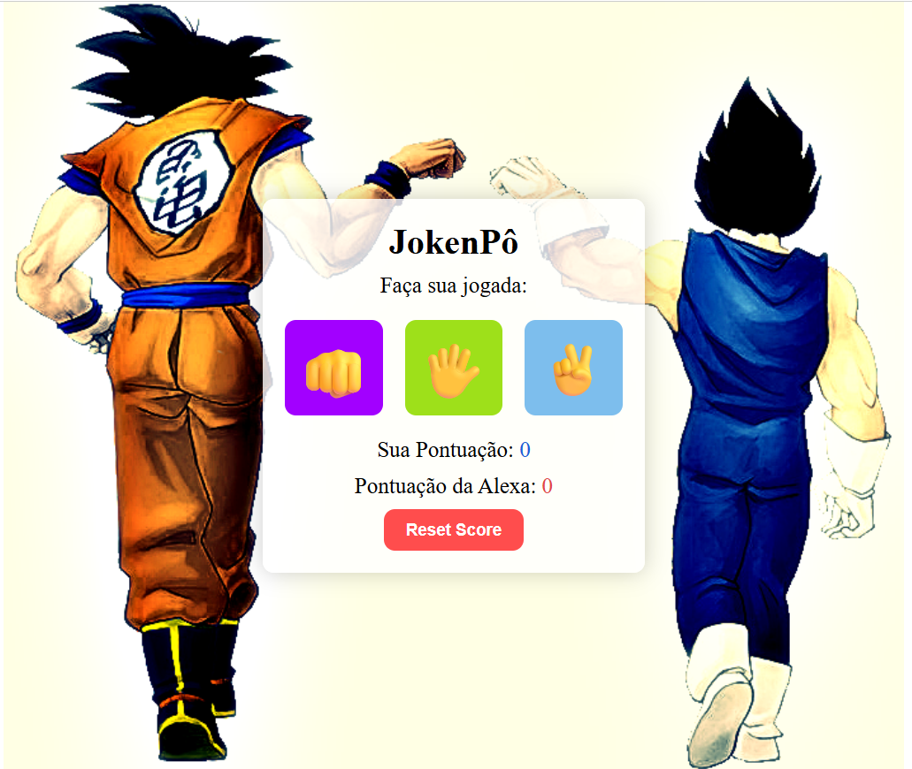

# 🎮 JokenPô - DevClub

Projeto de JokenPô desenvolvido com HTML, CSS e JavaScript durante os estudos de lógica de programação e manipulação do DOM.

---

## 🚀 Tecnologias utilizadas

- HTML5
- CSS3
- JavaScript

---

## 🎯 Funcionalidades

- ✅ Escolha entre Pedra, Papel ou Tesoura
- ✅ Jogada aleatória da Alexa
- ✅ Sistema de pontuação
- ✅ Mensagem de vitória, derrota e empate
- ✅ Emojis nas respostas
- ✅ Botão para resetar o placar
- ✅ Interface estilizada com tema Dragon Ball

---

## 📸 Preview do Projeto



---

## 🧠 Aprendizados

Neste projeto pratiquei:

- Manipulação do DOM
- Eventos com addEventListener
- Funções
- Condições (if / else)
- Operadores lógicos
- Arrays
- Objetos
- Math.random()
- Atualização dinâmica de elementos HTML
- Estilização com CSS

---

## 📂 Estrutura do Projeto

```bash
📁 projeto-jokenpo
 ┣ 📂 assets
 ┃ ┣ 📜 GokuEVegeta.png
 ┃ ┗ 📜 screenshot-JokenPo.png
 ┣ 📜 index.html
 ┣ 📜 style.css
 ┣ 📜 script.js
 ┗ 📜 README.md
```

---

## ▶️ Como executar o projeto

1. Clone este repositório

```bash
git clone https://github.com/feramos1987/Projeto-JokenP-.git
```
2. Abra a pasta do projeto

3. Execute o arquivo `index.html`

---

## 🌐 Projeto Online

Acesse o projeto publicado:

https://feramos1987.github.io/Projeto-JokenP-/

## 📌 Melhorias futuras

- 🔊 Adicionar efeitos sonoros
- ✨ Criar animações
- 🏆 Implementar modo melhor de 3
- 📱 Melhorar responsividade
- 💾 Salvar pontuação no navegador

---

## 👨‍💻 Autor

Desenvolvido por Felipe Ramos Leite da Silva durante os estudos no DevClub 🚀
